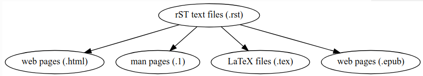

Click on headings to be directed to answers/more information (if available).

## [1. How to comment?](https://stackoverflow.com/questions/4783814/how-to-comment-a-string-in-restructured-text)
```rest
..
   _This: is a comment!

..
   [and] this!

..
   this:: too!

..
   |even| this:: !
```
Avoid putting comments on the same line as the double dots:
```rest
.. Avoid this type of comment
```
This is considered bad practice since it may lead to unintended consequences if the comment matches a proper markup construct.

## 2. How to display source code in your documentation?

### 2.1. Explicitly including code

#### 2.1.1. Code blocks
```rest
.. code-block:: language

   code
```

#### 2.1.2. Inline code block with syntax highlighting
First define a custom role. e.g.:

```rest
.. role:: bash(code)
   :language: bash
```

This then allows use inline code e.g.

```rest
Here is some awesome bash code :bash:`a = b + c`.
```

#### 2.1.3. Forcing syntax highlighting for a code snippet.
e.g. for a partial snippet of json code:

```rest
.. code-block:: json-object
    :force:

     "scripts": {
       "build": "webpack",
       "serve": "webpack-dev-server"
     },
```

### 2.2. Including existing source code 

You can use the `literalinclude` reST directive to include entire source code files or specific lines of the source code in your documentation without needing to duplicate code. 

```rest
.. literalinclude:: example.py
   :language: python
   :linenos:
   :lines: 1,3,5-10,20-
```

The `:linenos:` directive allows you to add line numbers when displaying the documentation.

See this [link](https://www.sphinx-doc.org/en/master/usage/restructuredtext/directives.html?highlight=literalinclude#directive-literalinclude) for more information.

However, referencing specific lines is not best practice since if the source code changes, the line numbers that are referenced in the documentation would typically need to change too.

Another way to reference code is to insert doc strings into the code itself to mark sections that you would like to reference in the documentation .e.g. in `example.py` you can insert the following:

```python
#!/usr/bin/env python

#DOC-START your_section_name
print("Hello World")
#DOC-END your_section_name
```

In your reST documentation, you can then include the code between `#DOC-START your_section_name` and `#DOC-END your_section_name` (you can rename `your_section_name` to be more meaninful for your code snippet).

```rest
.. literalinclude:: example.py
   :language: python
   :start-after: #DOC-START your_section_name
   :end-before: #DOC-END your_section_name
```

This will display the following when rendered: in the documentation:
```python
print("Hello World")
```

## 3. How to reference specific coding terms?

### 3.1. Reference user defined terms
```rest
 :term:`Your term`
```

e.g.
```rest
 :term:`CellML parameters field`
```
This will render as :term:`CellML parameters field`.

### 3.2. Referencing environmental variables
Use the following syntax to reference environmental variables:
```rest
:envvar:`OPENCMISS_ROOT`
```
This will render as :envvar:`OPENCMISS_ROOT`.

### 3.3. Python class methods
Use the following syntax to reference python class methods:
```rest
:py:meth:`CellML.CreateCellMLToFieldMap`
```
This will render as :py:meth:`CellML.CreateCellMLToFieldMap`.

### 3.4. An element in a GUI
Use the following syntax to direct a user to click a link or look to a certain area of the GUI:
```rest
:guilabel:`Main Menu`
```
This will render as :guilabel:`Main Menu`.

## [4. How to hyperlink and cross-reference?](https://docs.typo3.org/m/typo3/docs-how-to-document/master/en-us/WritingReST/Hyperlinks.html)

### 4.1. Hyperlinking
```rest
`anchor text <url>`__
```
### 4.2. Referencing section headings
Add `sphinx.ext.autosectionlabel` to extensions in :file:`conf.py`.
Add the following to :file:`conf.py`.
```python
# True to prefix each section label with the name of the document it is in, followed by a colon. For example, index:Introduction for a section called Introduction that appears in document index.rst. Useful for avoiding ambiguity when the same section heading appears in different documents.
autosectionlabel_prefix_document = True
```
Example usage:
```rest
A Plain Title
-------------

This is the text of the section.

It refers to the section title, see :ref:`A Plain Title`.

To reference section headings in other files:
:ref:`path/to/file:Section heading`
```

### 4.3. Cross-Referencing within a document
```rest
:ref:`anchor text <link-target>`
```
### 4.4. Cross-Referencing between documents
```rest
:ref:`anchor text <document-tag:link-target>`
```
Whenever you use the cross-referencing mechanism, you should create a link target for a section chapter, by adding a label before the section header:
```rest
.. _link-target:

Headline
========
```

### 4.5. Reference files and paths
Use the following syntax to reference files and paths:
```rest
:file:`myfile.txt`
```
This will output: :file:`myfile.txt`.

You can reference paths in the same way:
```rest
:file:`path/to/myfile.txt`
```
This will output: :file:`path/to/myfile.txt`.

## 5. How to allow the user to download specific source files?
Text snippets, large blocks of downloadable code, and even zip files or other binary sources can all be included as part of the documentation. To include files as part of the build process, use the following syntax:
```rest
:download:`An external file <readme.txt>`
```

## 6. How to create tables?

- [Programtically within .rst files](https://sublime-and-sphinx-guide.readthedocs.io/en/latest/tables.html)
- [Load from csv files](https://tables-with-sphinx.readthedocs.io/en/latest/csv-table.html)

## [7. How to add notes and warnings?](http://udig.refractions.net/files/docs/latest/user/docguide/sphinxSyntax.html#notes-and-warnings)

## 8. How to number sections?

```rest
.. toctree::
   :numbered: 3
   :maxdepth: 2

   registers/personal
```

More info `here <https://github.com/sphinx-doc/sphinx/issues/5047>`_

## [9. How to add images?](https://docs.typo3.org/m/typo3/docs-how-to-document/master/en-us/WritingReST/Images.html)

- Add the `:align: center` and `:figclass: align-center` directive options to center the figure and the caption. More information can be found []here](http://openalea.gforge.inria.fr/doc/openalea/doc/_build/html/source/sphinx/rest_syntax.html#figure-directive).
- Note that the path to the image is relative to the file you are referencing it from.

## 10. How to add a bibiliography?
The sphinx [sphinxcontrib-bibtex](https://sphinxcontrib-bibtex.readthedocs.io/en/latest/quickstart.html) extension can be used to insert citations and a bibliography to your documentation. These work similarly to LaTeX’s thebibliography environment and the `\citet` and `\citep` commands.

## 11. How to programmatically graphs/diagrams?
GraphViz is an extension that can be used to programmatically add graphs/diagrams to your documentation.

### 11.1. Setup
1. Add `sphinx.ext.graphviz` to extensions in `conf.py`
2. Add `graphviz_output_format = "svg"` in `conf.py`

### 11.2. Simple example
```rest
.. graphviz::

   digraph Sphinx {
      "rST text files (.rst)" -> "web pages (.html)";
      "rST text files (.rst)" -> "man pages (.1)";
      "rST text files (.rst)" -> "LaTeX files (.tex)";
      "rST text files (.rst)" -> "web pages (.epub)";
   }
```
This will render as:


### 11.3. Complex example
```rest
.. graphviz::

   digraph foo {
      rankdir="BT";
      graph [fontname="avenir", fontsize=10];
      node [fontname="avenir", fontsize=10, target="_blank" shape=rectangle, style=filled, fillcolor=darkseagreen2];
      edge [fontname="avenir", fontsize=10, style=dashed, arrowhead=onormal];
      Thing [label="SO:Thing", href="https://schema.org/Thing"];
      CreativeWork [href="https://schema.org/CreativeWork"];
      Dataset [href="https://schema.org/Dataset"];
      MediaObject [href="https://schema.org/MediaObject"];
      DataDownload [href="https://schema.org/DataDownload"];
      Intangible [href="https://schema.org/Intangible"];
      PropertyValue [href="https://schema.org/PropertyValue"];
      Place [href="https://schema.org/Place", target="_blank"];
      Person [href="https://schema.org/Person", target="_blank"];
      Organization [href="https://schema.org/Organization"];

      CreativeWork -> Thing;
      Intangible -> Thing;
      Place -> Thing;
      Person -> Thing;
      Organization -> Thing;
      Dataset -> CreativeWork;
      MediaObject -> CreativeWork;
      DataDownload -> MediaObject;
      PropertyValue -> Intangible;
   }
```
See source for this example [here](https://github.com/datadavev/sotools/blob/master/docsource/source/index.rst).
