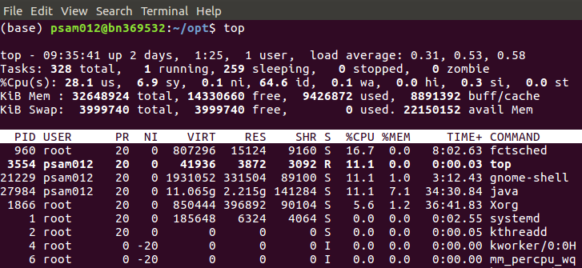

==================
The Linux terminal
==================

Introduction
============
We will be interacting with Linux through a command-line interface (also called a terminal or shell). Familiarise yourself with the terminal using the following guides:

- `Ubuntu.com guide <https://ubuntu.com/tutorials/command-line-for-beginners#1-overview>`_
- `Linux journey guide <https://linuxjourney.com/lesson/the-shell>`_
- `Bash guide by astrobiomike <https://astrobiomike.github.io/bash/>`_

.. tip::
   On linux, you can perform a quick copy paste by selecting any text (e.g. in a terminal, text editors etc), then middle click to directly paste without needing to use the keyboard.

.. tip::
  Terminals can autocomplete text, so you only need to type a few letters and press tab to autocomplete. If there are multiple options press tab twice to see the options. You can also use autocomplete with the ipython terminal.

Commonly used commands
======================
.. list-table:: Terminal commands
   :widths: 30, 70
   :header-rows: 1

   * - Command
     - Description
   * - ~
     - home directory
   * - cd ~
     - change to your home directory
   * - cd ..
     - change to the directory above the current directory e.g.
   * - pwd
     - list files in current directory
   * - program_name &
     - sends application to the background
   * - ls
     - list contents of current directory
   * - ls -lrt
     - list contents of current directory with more details
   * - cat filename
     - print contents of a text file to screen

Environmental variables
=======================
In linux, environmental variables are used to store global variables.

.. list-table:: Environmental variable examples
   :widths: 30, 70
   :header-rows: 1

   * - Variable
     - Description
   * - $PATH
     - Identifies the directories that the shell searches in to find programs that you want to execute. This is represented as a single string, with directories separated by a colon e.g “/usr/bin:/usr/local/bin”
   * - $PYTHONPATH
     - Identifies the directories that python searches in when importing modules. Individual directories are also separated by a colon.

Note that these environmental variables are typically already set. To see what their value has been set to, use the echo command:

.. code-block:: bash

   echo $PATH

By default, your `$PATH` variable could include the following values:

.. code-block:: bash

   /usr/local/sbin:/usr/local/bin:/usr/sbin:/usr/bin:/sbin:/snap/bin

Environmental variables can be set using the bash `export` command:

.. code-block:: bash

   export PATH=/hpc/hpat721/usr/pycharm/pycharm-community-2019.3.3/bin/:$PATH

Adding program locations to your PATH environmental variable
============================================================
You can add the directory where you have installed a program to your path so that you do not have type in the full path to the program to execute it. This can be achieved by adding the directory containing your program to the `$PATH` environmental variable.

For a Bash shell, you can set environment variables as shown e.g.

.. code-block:: bash

   export PYTHONPATH=”/my/new/path/”

or you can prepend values to an existing environment variable e.g.

.. code-block:: bash

   export PATH=”/my/new/path/:$PATH”

or you can append values to an existing environment variable e.g.

.. code-block:: bash

   export PATH=”$PATH:/my/new/path/”

Editing terminal start up scripts
=================================
Each time a terminal is opened, a startup shell script is automatically run. You can store custom terminal commands in this startup shell script e.g. you could add directories which contain your programs to the PATH environment variable (described in the previous section) so that you can just run the program by typing its name in the terminal and not have to type in the full path.

The Bash shell startup script  is located in the `~/.bashrc` text file.
To edit the script, use the following command to start a text editor e.g. gedit

.. code-block:: bash

   gedit ~/.bashrc

New environmental variables can be specified in this file or, alternatively, values can be appended to existing environmental variables.

After editing the file, save and exit. The updated path will then be available when you open a new terminal. If you want the PATH variable to be updated in your current terminal session, then type the following command:

.. code-block:: bash

   source ~/.bashrc

Identifying running processes
=============================
Use the `top` command to list the running programs (also known as a process). Each running process has an associated process id (PID).

Press the :kbd:`c` button to see the full path to the program. To quit the `top` process viewer, press the :kbd:`q` button.

Alternatively you can list processes that have been created by a specific user (e.g. user psam012 as shown below):

.. code-block:: bash

   top -u psam012

If you know the name of a running command/process, you can directly search for it's process id using the following command:

.. code-block:: bash

   ps -ef | grep search_term

Where the `search_term` could be for example `pycharm.sh`. The process id is shown in the first column.

Killing processes
=================
You can kill a process manually using the following command:

.. code-block:: bash

   kill -9 process_id

With `process_id` being replaced by the process id number identified from the `top` or `ps -ef` commands.
