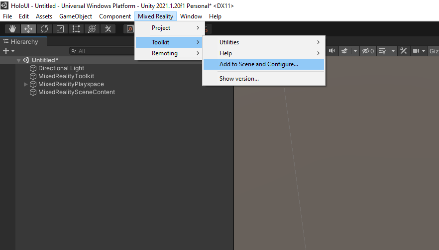
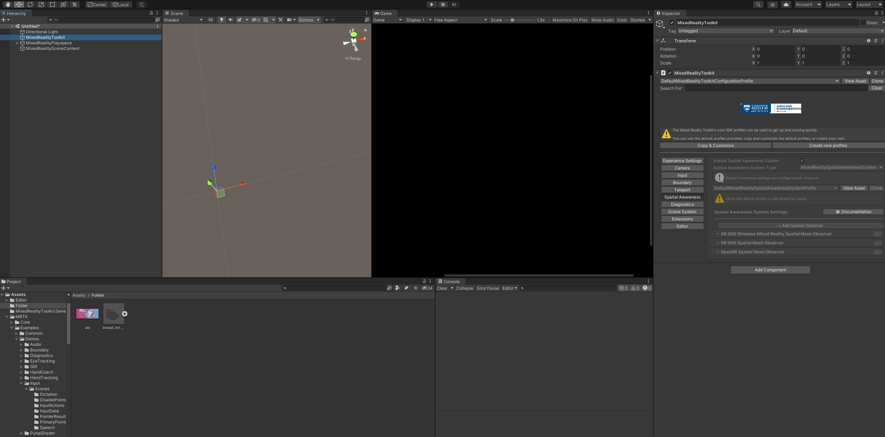
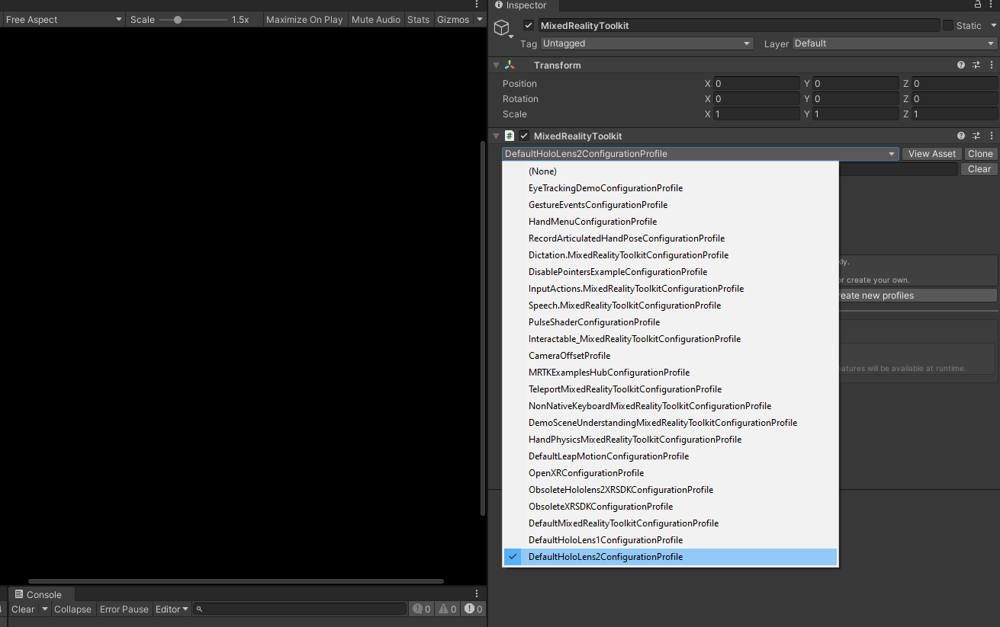

==================================
Building the first Holo Cube Scene
==================================

Now let’s get started to set up our Holo cube as in Figure 1. First, we need to add the Mixed Reality Toolkit object to our current scene. Go to Mixed Reality Toolkit -> Add to Scene and Configure. See Figure below.

Then you will see MixedRealityToolkit object in the Hierarchy panel with a Directional Light object and MixedRealityPlaySpace object.

Now let’s first hide the spatial awareness mesh. Otherwise, what you see will look like below as in Figure 21. What you see in the background with white lines with a bunch of triangles is called ‘spatial mesh’. It is very useful in AR but you can make it invisible to the user.

.. figure:: fig14.gif
  :width: 700
  :align: center
  :figclass: align-center

In order to make the spatial awareness mesh invisible, you have to edit Mixed Reality Toolkit Profiles. The default MRTK profiles are not editable. Thus, we have to clone these profiles in order to edit. There are several nested layers of profiles. Each time we have to clone and edit several profiles when configuring one or more settings.
Alright, let’s get started. Click on the MixedRealityToolkit object and while it is selected in the Hierarchy panel, in the Inspector window, change the Mixed Reality Toolkit Configuration Profile to DefaultHoloLens2ConfigurationProfile.

  Then, click the Copy & Customize button to open the Clone Profile window as in Figure 23. Then click the Clone button on the window. You will see in the Inspector Window under MixedReality Toolkit, New MixedRealityToolkitConfigurationProfile is created. Now there are several nested layers of profiles we need to clone. Click on the Spatial Awareness tab and then tick the Enable Spatial Awareness System checkbox. After that clone DefaultMixedrealitySpatialAwarenesssystemProfile. Again another Clone Profile window will open. Click the clone button.
