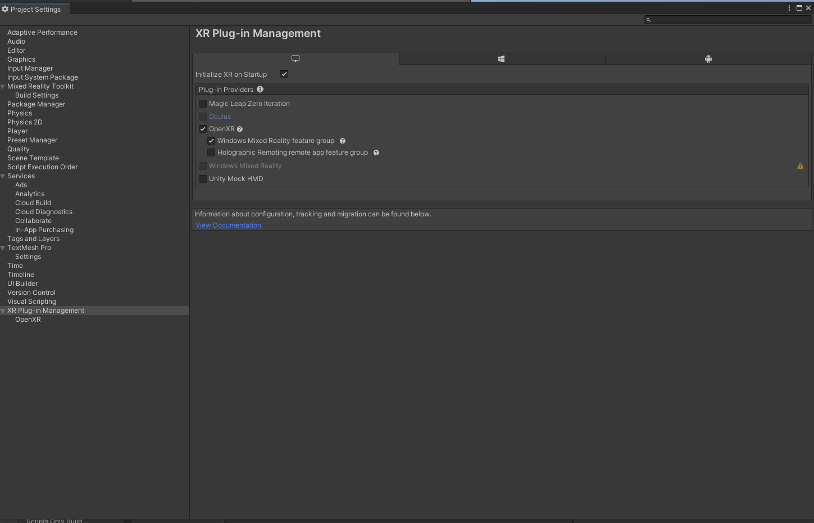

====================
New Unity Project
====================

Welcome to Augmented Reality (AR) experiences. In this article, I will guide you through how to build your first hologram with Microsoft HoloLens 2 (HL2).
Even if you do not have a device you can still try this guide with HoloLens 2 emulator (See prerequisites to find the download link for HL2 emulator).

What are we going to do? We will create a hologram, with which a user can interact, as shown in Figure 1. Firstly, in this article, we will build an application as in Figure 2.
Afterwards, you can go through my other very short article on How to build your AR Application to your HoloLens 2 and deploy this application (call it AppX) and experience it as in Figure 1.

.. figure:: figure1.gif
  :width: 700
  :align: center
  :figclass: align-center

If you do not have a HL2 then you use either HL 2 emulator (which I have not explained here) or use Unity to simulate this (as in Figure 2).

Prerequisites
-------------

1.  A Windows 10 computer
2.  Visual Studio 2019 community version installed with ‘Desktop development with C++’ and ‘Universal Windows Platform (UWP) development’. You can tick these two workloads during the installation process.
3.  A HoloLens 2 device (or you can use the emulator)
4.  Unity Hub with Unity 2019.3.X installed and the Universal Windows Platform (UWP). Again you can tick this module (UWP) during the installation process)
5.  Unity Mixed reality Tool Kit (MRTK) version 2.3.0 — Download from here.

Let’s get started.

Assuming that you installed Visual Studio 2019 and Unity Hub with Unity version 2021.1.X (I use 2021.1.20f1), let us get started. Optionally, you can install the HL2 emulator if you do not have access to a device; the only difference is that you have to choose the emulator instead of ‘Device’ when running the project through Visual Studio. If you have all these tools installed you are all set to follow the rest of the steps. Please leave a comment if you find any issue during the installation process, I will try and answer them.

Configuring Unity to start with MRTK
------------------------------------

First, you need to open Unity Hub and create a new project. Make sure to select 3D and give a name to the project and select a location and click on ‘CREATE’. Keep in mind that Windows OS has a MAX_PATH limit of 255 characters. Therefore, store your Unity project as close to the root of the drive.

The first thing you have to do is changing the build setting. Go to File -> Build Settings… (Or press Ctrl+Shift+B). A window will pop up and select the Universal Windows Platform and select the Target device as HoloLens and Architecture as ARM64. (Refer to Figure  below)

  .. figure:: figure4.png
    :width: 700
    :align: center
    :figclass: align-center

Then, click on the Switch Platform button and close the popup window. Next, go to Edit -> Project settings… You will be presented with another window as in Figure below. On the left-hand side of the window select Player.

Expand XR Plugin Management and tick Open XR. Once you tick this you will see a ‘+’ mark appear. Click on it and select Windows Mixed Reality feature group as shown in Figure below.

Before closing the Project settings there is one more setting to tick. Collapse Player Settings and expand Publishing Settings. Go to Universal windows Platform tab. Scroll down until you find Capabilities list and tick SpacialPerception, Webcam, Microphone and Internet Client. This allows the visualization of the spatial mapping mesh on Windows Mixed Reality devices. See Figure below to find the screen capture with the described setting. After this, close the Project Settings window.

  .. figure:: fig7.png
    :width: 700
    :align: center
    :figclass: align-center

While Unity completes the import, download Microsoft.MixedReality.Toolkit.Unity.Foundation.2.7.3.unitypackage and Microsoft.MixedReality.Toolkit.Unity.Tools.2.7.3.unitypackage (Optional but recommended). Go to Assets -> Import Packages -> Custom Packages. See Figure below.

Then, select the Microsoft.MixedReality.Toolkit.Unity.Foundation.2.7.3.unitypackage. Again click All and then the Import buttons. Refer figure below.

Let Unity install all the necessary packages. This might take a while. Maybe a few minutes depending on your computer’s specifications. Once Unity finishes all the imports you will get an MRTK popup window as in Figure below. Click on the Apply button.

If you did not get a popup window as in Figure above, go to Mixed Reality Toolkit -> Utilities -> Configure Unity Project. This will provide the same window.
Now repeat the sets in Figure 11 to install Microsoft.MixedReality.Toolkit.Unity.Tools.2.7.3.unitypackage. This is optional but I find this helpful; you can eliminate this step if you choose. Go to Assets -> Import Packages -> Custom Packages and then select the download package (Microsoft.MixedReality.Toolkit.Unity.Tools.2.7.7.unitypackage) and click All and the Import buttons. Refer to Figure 18 below.

If you come this far, congratulations, you have completed the Unity configuration to work with Mixed reality Toolkit (MRTK 2.7.3).
